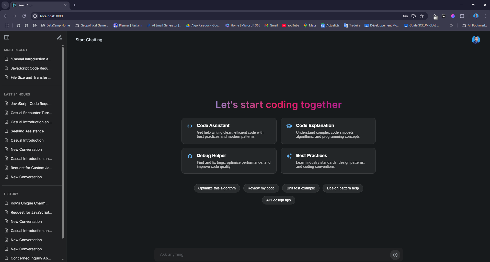
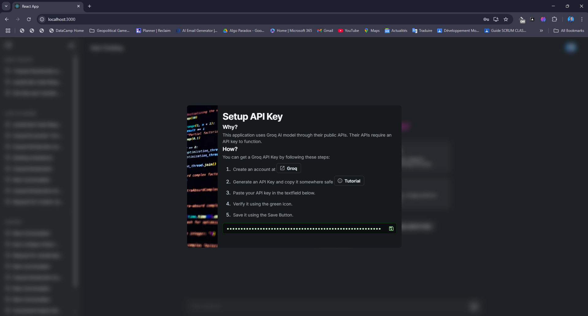
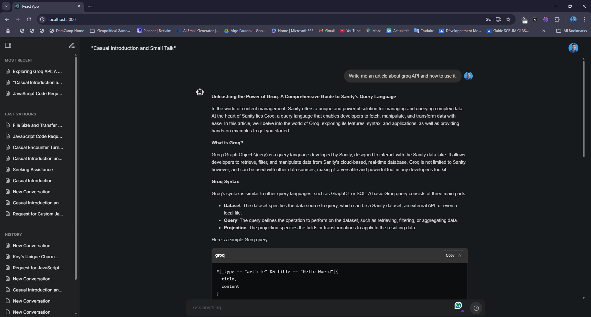
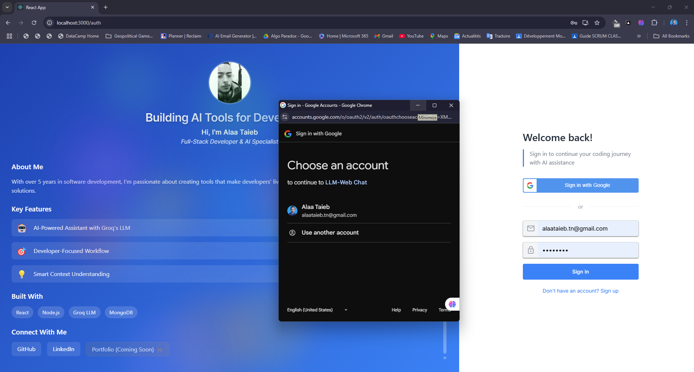
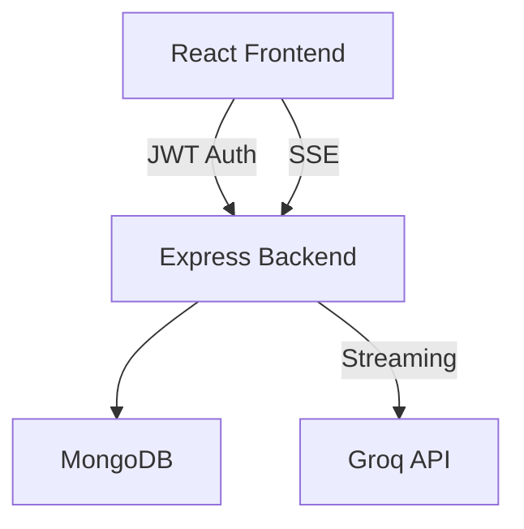

# LLM Web Interface



A sophisticated web application that provides an intuitive interface for interacting with Large Language Models, specifically integrated with Groq's cutting-edge LLMs. Built with React, Node.js, and MongoDB, featuring real-time streaming responses and markdown rendering.

## 🚀 Technical Highlights

- **Real-time Response Streaming**: Implements server-sent events for fluid, token-by-token LLM responses
- **Secure API Key Management**: Custom-built system for handling Groq API keys with encryption
- **JWT Authentication**: Google OAuth integration with secure token-based session management
- **Rich Text Rendering**: Markdown support with syntax highlighting for code blocks
- **Responsive Design**: Material UI (Joy) components with dynamic layout adaptation

## 💻 Core Technologies

### Frontend
- React.js with Context API for state management
- Material UI Joy for modern, responsive UI components
- Real-time message streaming implementation
- Dynamic textarea sizing and message rendering

### Backend
- Node.js & Express.js RESTful API
- MongoDB with Mongoose ODM
- JWT-based authentication
- Groq API integration with streaming support

## 🎯 Key Features

### Secure API Key Management

- Interactive API key validation
- Secure storage with encryption
- Step-by-step setup tutorial

### Rich Chat Interface

- Real-time message streaming
- Code syntax highlighting
- Markdown rendering
- Dynamic message history

### Authentication System

- Google OAuth integration
- Secure session management
- Protected routes

## 🛠️ Architecture



## 🚀 Getting Started

1. Clone the repository
```bash
git clone https://github.com/Alaa-Taieb/LLM-Web-Interface.git
```

2. Install dependencies
```bash
# Frontend
cd client && npm install

# Backend
cd server && npm install
```

3. Set up environment variables
```bash
# Server .env
PORT=5000
DB=your_db_name
ATLAS_USERNAME=your_username
ATLAS_PASSWORD=your_password
JWT_SECRET=your_jwt_secret
GOOGLE_CLIENT_ID=your_google_client_id
GOOGLE_CLIENT_SECRET=your_google_client_secret

# Client .env
REACT_APP_API_URL=http://localhost:5000
```

4. Start the development servers
```bash
# Frontend
cd client && npm start

# Backend
cd server && npm run dev
```

## 🔧 Technical Deep Dive

### Real-time Message Streaming
```javascript
const stream = await groq.chat.completions.create({
    messages: apiMessages,
    model: 'llama3-70b-8192',
    stream: true,
});

for await (const chunk of stream) {
    const content = chunk.choices[0]?.delta?.content || "";
    // Real-time updates to UI
}
```

### Security Implementation
```javascript
// API Key encryption
const encrypted = crypto.encrypt(apiKey);
await ApiKey.create({ 
    user: userId,
    key: encrypted,
    name: keyName 
});
```

## 🤝 Contributing

Contributions are welcome! Feel free to submit issues and pull requests.

## 📝 License

This project is licensed under the MIT License - see the [LICENSE](LICENSE) file for details.

---
Built with 💻 by [Alaa Taieb](https://github.com/Alaa-Taieb)